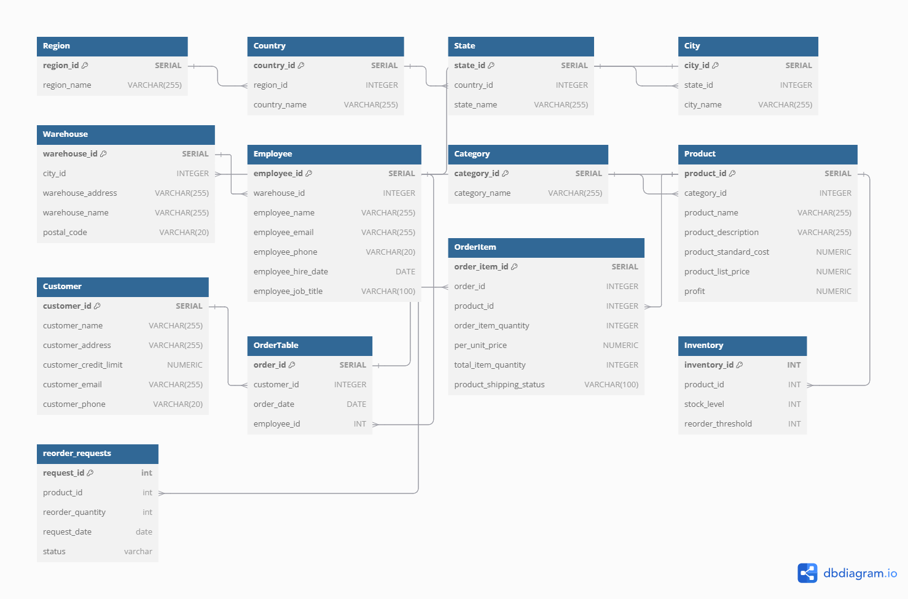

# Data Normalization and Database Setup Process

This README provides a detailed explanation of the steps involved in normalizing a dataset, creating a relational database, and migrating data to the normalized schema. The process was implemented using SQL code provided in the  and the [database diagram code file](./schema/dbdiagram_code.sql). Below, each step is explained in detail.

---

## 1. Loading and Examining the Dataset

The dataset is first opened in excel to identify th different tables. This table holds all the original data as is from the source file. The structure is inspected to understand its columns and values.


---

## 2. Identifying Column Names for Normalization

Using the original dataset we have opened in excel, distinct attributes in the dataset are then identified and grouped based on their relevance to different entities, such as Users, Products, and Orders.

# Column Names in the Original Dataset

Below is the complete list of column names present in the original dataset:

1. **RegionName**
2. **CountryName**
3. **State**
4. **City**
5. **PostalCode**
6. **WarehouseAddress**
7. **WarehouseName**
8. **EmployeeName**
9. **EmployeeEmail**
10. **EmployeePhone**
11. **EmployeeHireDate**
12. **EmployeeJobTitle**
13. **CategoryName**
14. **ProductName**
15. **ProductDescription**
16. **ProductStandardCost**
17. **Profit**
18. **ProductListPrice**
19. **CustomerName**
20. **CustomerAddress**
21. **CustomerCreditLimit**
22. **CustomerEmail**
23. **CustomerPhone**
24. **Status**
25. **OrderDate**
26. **OrderItemQuantity**
27. **PerUnitPrice**
28. **TotalItemQuantity**

taking these column names into consideration, we then group each them using normalization. Normalization organizes data to reduce redundancy and improve data integrity by dividing information into related tables with defined relationships.

### Purpose

- Ensure each table represents a single entity
- Maintain data consistency
- Improve query efficiency
- Simplify database maintenance

### Normalized Entities

#### 1. Region

- **Columns:**
  - RegionName
  - CountryName
  - State
  - City
  - PostalCode
- _Purpose:_ Geographic location tracking

#### 2. Warehouse

- **Columns:**
  - WarehouseAddress
  - WarehouseName
- _Purpose:_ Warehouse location management

#### 3. Employee

- **Columns:**
  - EmployeeName
  - EmployeeEmail
  - EmployeePhone
  - EmployeeHireDate
  - EmployeeJobTitle
- _Purpose:_ Employee information tracking

#### 4. Category

- **Columns:**
  - CategoryName
- _Purpose:_ Product categorization

#### 5. Product

- **Columns:**
  - ProductName
  - ProductDescription
  - ProductStandardCost
  - Profit
  - ProductListPrice
  - CategoryName (FK)
- _Purpose:_ Product details management

#### 6. Customer

- **Columns:**
  - CustomerName
  - CustomerAddress
  - CustomerCreditLimit
  - CustomerEmail
  - CustomerPhone
- _Purpose:_ Customer information storage

#### 7. Order

- **Columns:**
  - OrderDate
  - Status
  - CustomerName (FK)
- _Purpose:_ Order tracking

#### 8. OrderItem

- **Columns:**
  - OrderItemQuantity
  - PerUnitPrice
  - TotalItemQuantity
  - ProductName (FK)
  - OrderDate (FK)
- _Purpose:_ Order details management

---

## 3. Creating Normalized Tables

Normalized tables are created to organize the data efficiently. The schema consists of the following tables:

- **Region Table**:

  ```sql
  CREATE TABLE Region (
        region_id SERIAL PRIMARY KEY,
        region_name VARCHAR(255) UNIQUE
    );
  ```

- **Country Table**:

  ```sql
  CREATE TABLE Country (
        country_id SERIAL PRIMARY KEY,
        region_id INTEGER REFERENCES Region(region_id),
        country_name VARCHAR(255) UNIQUE
    );
  ```

- **State Table**:

  ```sql
  CREATE TABLE State (
        state_id SERIAL PRIMARY KEY,
        country_id INTEGER REFERENCES Country(country_id),
        state_name VARCHAR(255) UNIQUE
    );
  ```

- **City Table**:

  ```sql
    CREATE TABLE City (
        city_id SERIAL PRIMARY KEY,
        state_id INTEGER REFERENCES State(state_id),
        city_name VARCHAR(255) UNIQUE
    );
  ```

- **Warehouse Table**:

  ```sql
    CREATE TABLE Warehouse (
        warehouse_id SERIAL PRIMARY KEY,
        city_id INTEGER REFERENCES City(city_id),
        warehouse_address VARCHAR(255),
        warehouse_name VARCHAR(255),
      postal_code VARCHAR(20)
    );
  ```

- **Employee Table**:

  ```sql
    CREATE TABLE Employee (
        employee_id SERIAL PRIMARY KEY,
        warehouse_id INTEGER REFERENCES Warehouse(warehouse_id),
        employee_name VARCHAR(255),
        employee_email VARCHAR(255) UNIQUE,
        employee_phone VARCHAR(20),
        employee_hire_date DATE,
        employee_job_title VARCHAR(100)
    );
  ```

- **Category Table**:

  ```sql
    CREATE TABLE Category (
        category_id SERIAL PRIMARY KEY,
        category_name VARCHAR(255) UNIQUE
    );
  ```

- **Product Table**:

  ```sql
    CREATE TABLE Product (
        product_id SERIAL PRIMARY KEY,
        category_id INTEGER REFERENCES Category(category_id),
        product_name VARCHAR(255),
        product_description VARCHAR(255),
        product_standard_cost NUMERIC,
        product_list_price NUMERIC,
        profit NUMERIC
    );
  ```

- **Customer Table**:

  ```sql
    CREATE TABLE Customer (
        customer_id SERIAL PRIMARY KEY,
        customer_name VARCHAR(255),
        customer_address VARCHAR(255),
        customer_credit_limit NUMERIC,
        customer_email VARCHAR(255) UNIQUE,
        customer_phone VARCHAR(20)
    );
  ```

- **OrderTable Table**:

  ```sql
    CREATE TABLE OrderTable (
        order_id SERIAL PRIMARY KEY,
        customer_id INTEGER REFERENCES Customer(customer_id),
        order_date DATE
    );
  ```

- **OrderItem Table**:
  ```sql
    CREATE TABLE OrderItem (
        order_item_id SERIAL PRIMARY KEY,
        order_id INTEGER REFERENCES OrderTable(order_id),
        product_id INTEGER REFERENCES Product(product_id),
        order_item_quantity INTEGER,
        per_unit_price NUMERIC,
        total_item_quantity INTEGER,
        product_shipping_status VARCHAR(100)
    );
  ```

---

## 4. Creating a Loading Table

A `staging_inventory` or loading table is created to hold all raw data temporarily. This table simplifies the process of migrating data into the normalized schema.

```sql
CREATE TABLE staging_inventory (
    "RegionName" TEXT,
    "CountryName" TEXT,
    "State" TEXT,
    "City" TEXT,
    "PostalCode" TEXT,
    "WarehouseAddress" TEXT,
    "WarehouseName" TEXT,
    "EmployeeName" TEXT,
    "EmployeeEmail" TEXT,
    "EmployeePhone" TEXT,
    "EmployeeHireDate" DATE,
    "EmployeeJobTitle" TEXT,
    "CategoryName" TEXT,
    "ProductName" TEXT,
    "ProductDescription" TEXT,
    "ProductStandardCost" NUMERIC,
    "Profit" NUMERIC,
    "ProductListPrice" NUMERIC,
    "CustomerName" TEXT,
    "CustomerAddress" TEXT,
    "CustomerCreditLimit" NUMERIC,
    "CustomerEmail" TEXT,
    "CustomerPhone" TEXT,
    "Status" TEXT,
    "OrderDate" DATE,
    "OrderItemQuantity" INTEGER,
    "PerUnitPrice" NUMERIC,
    "TotalItemQuantity" INTEGER
);
```

---

## 5. Populating the Loading Table

All data from the original dataset table now needs to be inserted into the `staging_inventory` table for data mapping.
With pgAdmin, the data from the the original dataset can be easily imported into the loading table using its GUI.

**Step 1**
After creating the loading table, right-click on the table name and select the Import/Export option.


**Step 2**
An Import/Export Data window with two tabs—Options and Columns—will be opened for that specific table. The Import option from the Import/Export toggle button is selected. Now, the path of the file that needs to be imported is mentioned. The format of the file is selected as CSV and the delimiter of the file is specified. Click on the OK button to start the importing process.


A popup window will appear once the data from the CSV file has been successfully copied to PostgreSQL.

**NOTE:** Most of the processes done using SQL code can actually be done using the pgadmin user interface, but that is beyond the scope of this project. This pgadmin import method wasn't actually used in the project itself to populate the staging table. The psql interface of pgadmin was used instead. It's process wasn't fully documented, so therefore cannot be reffered to for documentation purposes.

---

## 6. Migrating Data to Normalized Tables

Data is extracted from the `staging_inventory` and inserted into the respective normalized tables.

- Populating the different tables:

  ```sql
    INSERT INTO Region (region_name)
        SELECT DISTINCT "RegionName"
        FROM staging_inventory;

    INSERT INTO Country (country_name, region_id)
        SELECT DISTINCT si."CountryName", r.region_id
        FROM staging_inventory AS si
        LEFT JOIN Region AS r
            ON si."RegionName" = r.region_name
        ON CONFLICT (country_name) DO NOTHING;

    INSERT INTO State (state_name, country_id)
        SELECT DISTINCT si."State", c.country_id
        FROM staging_inventory AS si
        JOIN Country AS c
            ON si."CountryName" = c.country_name;

    INSERT INTO City (city_name, state_id)
        SELECT DISTINCT si."City", s.state_id
        FROM staging_inventory AS si
        JOIN state AS s
            ON si."State" = s.state_name;

    INSERT INTO Warehouse (city_id, warehouse_address, warehouse_name, postal_code)
        SELECT
            ci.city_id,
            si."WarehouseAddress",
            si."WarehouseName",
            si."PostalCode"
        FROM staging_inventory AS si
        JOIN city AS ci
            ON si."City" = ci.city_name;

    INSERT INTO Employee (employee_email, warehouse_id, employee_name, employee_phone, employee_hire_date, employee_job_title)
        SELECT
            DISTINCT si."EmployeeEmail",
            w.warehouse_id,
            si."EmployeeName",
            si."EmployeePhone",
            si."EmployeeHireDate"::DATE,
            si."EmployeeJobTitle"
        FROM staging_inventory AS si
        JOIN Warehouse AS w
            ON si."WarehouseName" = w.warehouse_name
        ON CONFLICT (employee_email) DO NOTHING;

    INSERT INTO Category (category_name)
        SELECT DISTINCT "CategoryName"
        FROM staging_inventory;

    INSERT INTO Product (category_id, product_name, product_description, product_standard_cost, product_list_price, profit)
        SELECT
            c.category_id,
            si."ProductName",
            si."ProductDescription",
            si."ProductStandardCost",
            si."ProductListPrice",
            si."Profit"
        FROM staging_inventory AS si
        JOIN Category AS c
            ON si."CategoryName" = c.category_name;

    INSERT INTO Customer (customer_email, customer_name, customer_address, customer_credit_limit, customer_phone)
        SELECT
            DISTINCT si."CustomerEmail",
            si."CustomerName",
            si."CustomerAddress",
            si."CustomerCreditLimit",
            si."CustomerPhone"
        FROM staging_inventory AS si;

    INSERT INTO OrderTable (customer_id, order_date)
        SELECT
            c.customer_id,
            si."OrderDate"::DATE
        FROM staging_inventory AS si
        JOIN Customer AS c
            ON si."CustomerName" = c.customer_name;

    INSERT INTO OrderItem (order_id, product_id, order_item_quantity, per_unit_price, total_item_quantity, product_shipping_status)
        SELECT
            o.order_id,
            p.product_id,
            si."OrderItemQuantity",
            si."PerUnitPrice",
            si."TotalItemQuantity",
            si."Status"
        FROM staging_inventory si
        JOIN OrderTable AS o
            ON si."OrderDate" = o.order_date
                AND si."CustomerName" = (
                    SELECT customer_name
                    FROM customer
                    WHERE customer_id = o.customer_id)
        JOIN product AS p
            ON si."ProductName" = p.product_name;
  ```

After further evaluation, it is recommended that the `employee_id` column be added to the `OrderTable` table, so as to link each employee to each order made.

- Updating the `OrderTable` table:

  ```sql
    UPDATE OrderTable AS o
        SET employee_id = emp_data.employee_id
        FROM (
            SELECT DISTINCT si."EmployeeEmail", e.employee_id, si."OrderDate"
            FROM staging_inventory AS si
            JOIN employee AS e
                ON si."EmployeeEmail" = e.employee_email
        ) AS emp_data
        WHERE o.order_date = emp_data."OrderDate"
            AND o.employee_id IS NULL;  -- Only update orders where the employee_id is not yet set
  ```

---

## 7. Dropping the Loading Table

Once all data has been migrated, the `staging_invemtory` table is dropped to clean up the database.

```sql
DROP TABLE staging_inventory;
```

---

## 8. Resetting Table Indices

The primary keys in each table are reset to start with `1` to ensure sequential indexing. We first check the sequence before resetting.

```sql
--check order sequence for id columns
SELECT sequence_name
FROM information_schema.sequences;

--reset sequence
ALTER SEQUENCE region_region_id_seq RESTART WITH 1;
ALTER SEQUENCE country_country_id_seq RESTART WITH 1;
ALTER SEQUENCE state_state_id_seq RESTART WITH 1;
ALTER SEQUENCE warehouse_warehouse_id_seq RESTART WITH 1;
ALTER SEQUENCE city_city_id_seq RESTART WITH 1;
ALTER SEQUENCE employee_employee_id_seq RESTART WITH 1;
ALTER SEQUENCE category_category_id_seq RESTART WITH 1;
ALTER SEQUENCE product_product_id_seq RESTART WITH 1;
ALTER SEQUENCE customer_customer_id_seq RESTART WITH 1;
ALTER SEQUENCE ordertable_order_id_seq RESTART WITH 1;
ALTER SEQUENCE orderitem_order_item_id_seq RESTART WITH 1;
```

---

## 9. Creating Inventory Table and ReorderRequests Table

Both the `Inventory` table and `ReorderRequests` table are not part of the original dataset. After careful comparison with other ideal databases used for inventory management, these two tables seemed to be needed for the database to be somewhat complete.
**NOTE:** The original dataset was not altered in this process.

```sql
--create the Inventory table
CREATE TABLE Inventory (
    inventory_id SERIAL PRIMARY KEY,
    product_id INT REFERENCES Product(product_id),
    stock_level INT,
    reorder_threshold INT
);

--start inventory_id sequence from 1
ALTER SEQUENCE inventory_inventory_id_seq RESTART WITH 1;

-- Create a table to store reorder requests
CREATE TABLE ReorderRequests (
    reorder_request_id SERIAL PRIMARY KEY,
    product_id INT REFERENCES Product(product_id),
    reorder_quantity INT,
    request_date DATE DEFAULT CURRENT_DATE,
    status VARCHAR(50) DEFAULT 'Pending'
);

--start reorder_request_id sequence from 1
ALTER SEQUENCE reorderrequests_reorder_request_id_seq RESTART WITH 1;
```

---

Refer to [database creation file](./sql/create_database.sql) for the SQL functions that will be used to populate the `Inventory` and `ReorderRequests` tables. These functions are not stated here because there may be a more efficient method for populating these tables which is not SQL based, all being also beyond the scope of this project.

## Conclusion

Here is the database diagram showing the different tables and their relationships -->



This step-by-step process ensures a clean and normalized database structure, ready for further analysis or use in applications.

By structuring the dataset in this way, the database adheres to the principles of normalization, specifically up to the Third Normal Form (3NF), ensuring minimal redundancy and maintaining data consistency.
